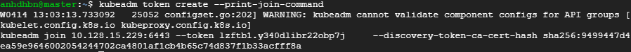
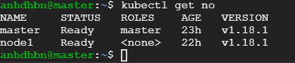
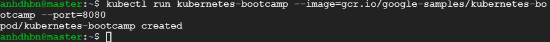
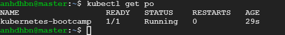

1. Disable SWAP
  ```bash
  swapoff -a
  ```
2. Disable SELinux
3. Install kubeadm, kubelet, kubectl
4. Initialize master node
  - Only on **master node**:
    ```bash
    kubeadm init --pod-network-cidr=10.240.0.0/16
    kubectl apply -f https://raw.githubusercontent.com/coreos/flannel/master/Documentation/kube-flannel.yml
    ```
  - Only on **worker nodes**:
    > Enter: `kubeadm token create --print-join-command` on **master node** to get join-command, copy it and paste to **worker nodes**
    
    Ex: `kubeadm join 10.128.15.229:6443 --token lzftb1.y340dlibr22obp7j     --discovery-token-ca-cert-hash sha256:9499447d4ea59e9646002054244702ca4801af1cb4b65c74d837f1b33acfff8a`
5. Testing
  - Get nodes: `kubectl get no`
    > 
  - Create hello-world app: `kubectl run kubernetes-bootcamp --image=gcr.io/google-samples/kubernetes-bootcamp --port=8080`
    > 
  - Get pods: `kubectl get po`
    > 
  - Remove pod: `kubectl delete pod kubernetes-bootcamp`
    > 