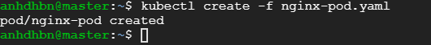
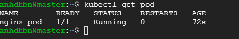
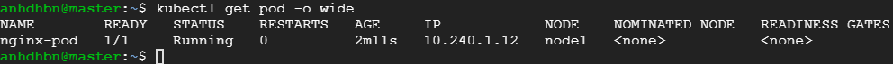

1. Create & Display: `kubectl create -f nginx-pod.yaml`
   
2. Get pod: `kubectl get pod`
   
3. Get more info: `kubectl get pod -o wide`
   
4. Describe: `kubectl describe pod nginx-pod`
5. Testing: `kubectl exec -it nginx-pod -- /bin/sh`
   ```bash
   cat <<EOF > /usr/share/nginx/html/test.html
   <!DOCTYPE html>
   <html>
   <head>
   <title>Testing...</title>
   </head>
   <body>
   <h1 style="color:rgb(90,70,250);">Hello, kubernetes...!</h1>
   </body>
   </html>
   EOF
   exit

   # Expode Pod
   kubectl expose pod nginx-pod --type=NodePort --port=80
   # Describe svc
   kubectl describe svc nginx-pod
   # Access webpage using http://nodeip:nodeport/test.html
   ````

6. Delete svc: `kubectl delete svc nginx-pod`
6. Delete pod: `kubectl delete pod nginx-pod`